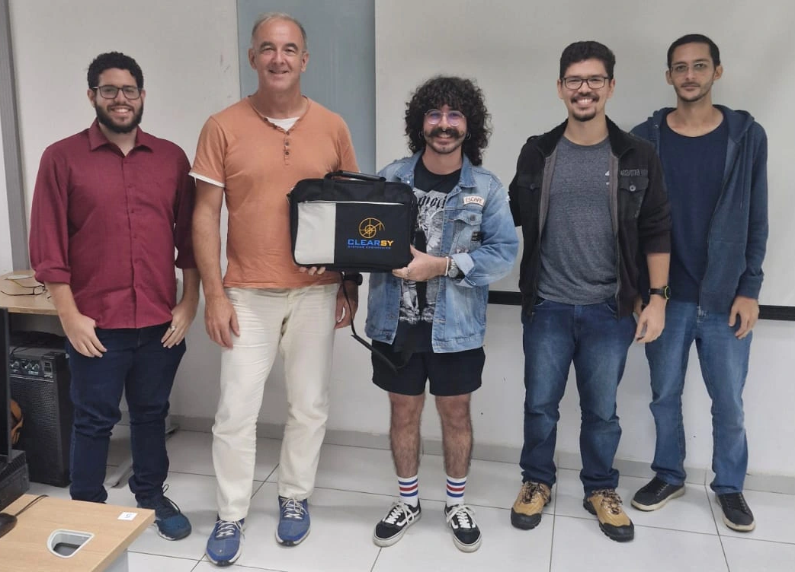

# Hackathon-2025
## Update
- 23/07/2025: solution part 2 + models part 1 & 2
- 22/07/2025: slides part 2 + solution part 1 added
- 21/07/2025: slides part 1 added
- 20/07/20225: intro slides day 1 added

## Description
This Hackathon is organized by [CLEARSY](https://www.clearsy.com/en/), with the active support of [Dr Marcel Oliveira](https://www.dimap.ufrn.br/~marcel).
It will take place at [Instituto Metropole Digital/UFRN](https://maps.app.goo.gl/tDVkFT9e4XMnW86L7) (Natal, Brazil) from 21/07/2025 to 25/07/2025, from 16:40 to 18:20 every day, for a total of 8h20.
It is aimed at using B for modelling and proving software with [Atelier B](https://www.atelierb.eu/en/) and [ProB](https://prob.hhu.de/).
The subjects are issued from concrete examples from real life. Their size and complexity are compatible with the format of the hackathon.

The first 3 students will receive respectively:
- #1 a portable PC (15.6", Ryzen 7 5700U (8C/16T, 4,3GHz) 16Go RAM DDR4x2 + 512Go M.2 SSD),

- #2 a 1To external USB SDD,
- #3 a 0.5To external USB SDD. 

In case of excellent performance, #1 will be offered the possibility to do a 6-month internship in France.
For more information, see:
- [Official Announcement from UFRN](https://boletim.ufrn.br/publico/informativo/4724.pdf)
- [IMD annoucement](https://www.instagram.com/reel/DHMIOGQS8PE/?igsh=bm5ncTMwdm5zM2Vs).
- [Empresa francesa oferece estágio para alunos da UFRN (Blog TribunalDoNorte 22/03/2025)](https://blog.tribunadonorte.com.br/territoriolivre/empresa-francesa-oferece-estagio-para-alunos-da-ufrn/)

## Organization
This hackathon is organized over 5 consecutive days.
It will address B modelling and be the occasion to assess:
- modelling skills using mathematical predicates
  - specification: how to transform a text in natural language into a formal model,
  - implementation: knowledge of the B0 principles (only deterministic substitutions and implementable types),
- understanding of the whole process:
  - ability to trigger typecheck, proof obligation generation, automatic provers
  - ability to correct a model
  - understanding of what a proof obligation is and to check visualy if it is true or false.

Students may collaborate over the differents parts of the hackathon. However reports are nominative and should be written by a single person.

Based on this report and solely on this report, a score will be given to each report. 
This score is used to nominate #1, #, and #3, who will receive a prize as described in the first paragraph. 

## Contents
This site contains some resources used for the Hackathon:
- models used to bootstrap subjects (to come - updated every day during the hackathon)
- pdfs of the slides presented (to come - updated every day during the hackathon)

Required modelling tools are:
- [Atelier B](https://www.atelierb.eu/en/atelier-b-support-maintenance/download-atelier-b/)  (Atelier B 24.04 CLEARSY Community Edition - installer)
- [ProB](https://prob.hhu.de/w/index.php?title=Download#ProB2-UI_(based_on_JavaFX)) (ProB2-UI - installer)

## Hackathon 2024: modelling railways signalling system

It happened in [July 2024](https://github.com/CLEARSY/hackathon-2024).
The winner was João Pedro with a perfect score.

## Hackathon 2023: modelling traffic lights

It happened in [July 2023](https://github.com/CLEARSY/hackathon).
The winner was João Gabriel.

## Contributers
- Thierry Lecomte: slides, edition, live presentation, and hackathon animation.

Shield: [![CC BY 4.0][cc-by-shield]][cc-by]

This work is licensed under a
[Creative Commons Attribution 4.0 International License][cc-by].

[![CC BY 4.0][cc-by-image]][cc-by]

[cc-by]: http://creativecommons.org/licenses/by/4.0/
[cc-by-image]: https://i.creativecommons.org/l/by/4.0/88x31.png
[cc-by-shield]: https://img.shields.io/badge/License-CC%20BY%204.0-lightgrey.svg
